# Binance_resender （PyTED量化交易研究院）

## 1. Binance_resender有什么用？

你可能遇到的问题：

1. 请求被Ban，国内服务器无法直接访问Binance API接口；
2. 使用HTTP Proxy代理存在网络不稳定性与秘钥安全问题；
3. 运行实盘算法需要高配置服务器，同配置的境外服务器价格比境内服务器价格贵数倍以上；
4. 本地测试每次都需要将代码同步给境外服务器，测试不方便；
5. 实盘服务每分钟的请求权重过多，经常被官方限制，如何通过多IP减缓权重压力；

你需要的可能是Binance_resender——来自PyTED量化交易全家桶的一员。

Binance_resender是用于转发Binance请求的Web服务，帮助用户搭建**私有**转发服务器，保证请求的稳定、低延时与秘钥安全，Binance_interface实盘交易框架全面支持Binance_resender功能。

通过Binance_resender你的实盘服务可以轻松为：

- 服务器A：内地高配置的算力服务器，计算开仓平仓条件 
- 服务器B：低配境外服务器，实时维护最新K线，用于服务器A计算
- 服务器C：用户同步多产品订单，因为Binance中查询全部挂单的权重巨大。
.. ...


## 2. 系统说明

1. 系统：Centos7.6
2. 地区：香港或新加坡（香港最优，速度约比新加坡服务器在请求延时上快5%~8%）
3. 转发服务器性能最低要求：（2C2G10Mbps）建议：（2C4G30Mbps）
4. 以下文档采用腾讯云的轻量应用服务器（2C4G30Mbps）

GITHUB：https://github.com/pyted/binance_resender

## 3. 安装Python环境

### 3.1 下载Python3.8.4

```cmd
cd /root
mkdir download
cd download
wget https://www.python.org/ftp/python/3.8.4/Python-3.8.4.tgz
```

### 3.2 安装依赖

```cmd
yum -y install openssl-devel
yum -y install bzip2-devel
yum -y install expat-devel
yum -y install gdbm-devel
yum -y install readline-devel
yum -y install sqlite-devel
yum -y install zlib-devel
yum -y install libffi-devel
yum -y install gcc
yum -y install zlib*
```

### 3.3 解压并安装

```cmd
tar -xvf Python-3.8.4.tgz
cd Python-3.8.4
mkdir /usr/local/python3.8.4
./configure --prefix=/usr/local/python3.8.4
make && make install
```

### 3.4 更新软连接

```cmd
rm -rf /usr/bin/python3
rm -rf /usr/bin/pip3
ln -s /usr/local/python3.8.4/bin/python3 /usr/bin/python3
ln -s /usr/local/python3.8.4/bin/pip3 /usr/bin/pip3
```


### 3.5 检测环境安装结果

```cmd
python3
```

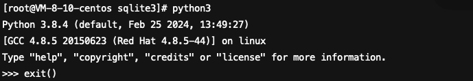

```cmd
pip3 --version
```

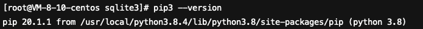

## 4. 安装Binance_resender

### 4.1 下载Binance_resender

```cmd
cd /root
yum -y install git
git clone https://github.com/pyted/binance_resender
```

### 4.2 安装依赖

```cmd
cd binance_resender
pip3 install -r requirements.txt --upgrade
```

注意：urllib3的版本，过高可能报错，建议版本为：

```cmd
pip3 install urllib3===1.26.12
```

### 4.3 修改Django源码以支持sqlite3

```cmd
vi /usr/local/python3.8.4/lib/python3.8/site-packages/django/db/backends/sqlite3/base.py
```

注释点sqlite3，换成pysqlite3

```python
# from sqlite3 import dbapi2 as Database   
from pysqlite3 import dbapi2 as Database 
```

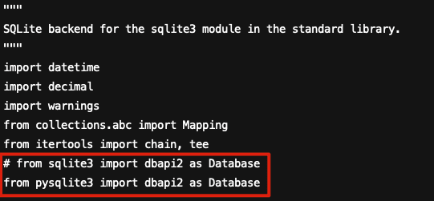

## 5. 启动服务

### 5.1 创建窗口

```cmd
yum -y install screen
screen -S binance_resender_server
```

### 5.2 启动转发服务

```cmd
cd /root/binance_resender
python3 -m uvicorn binance_resender.asgi:application --port 80 --host 0.0.0.0
```

### 5.3 测试服务

浏览器中访问：http://公网IP地址

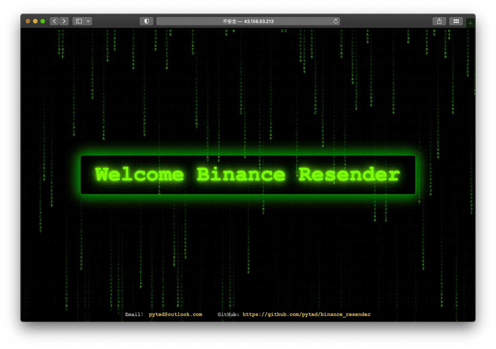

注意：防火墙注意需要开放HTTP|HTTPS端口

## 6. 转发管理

### 6.1 登录后台管理

地址：http://IP/admin

初始账号：root，密码：123456

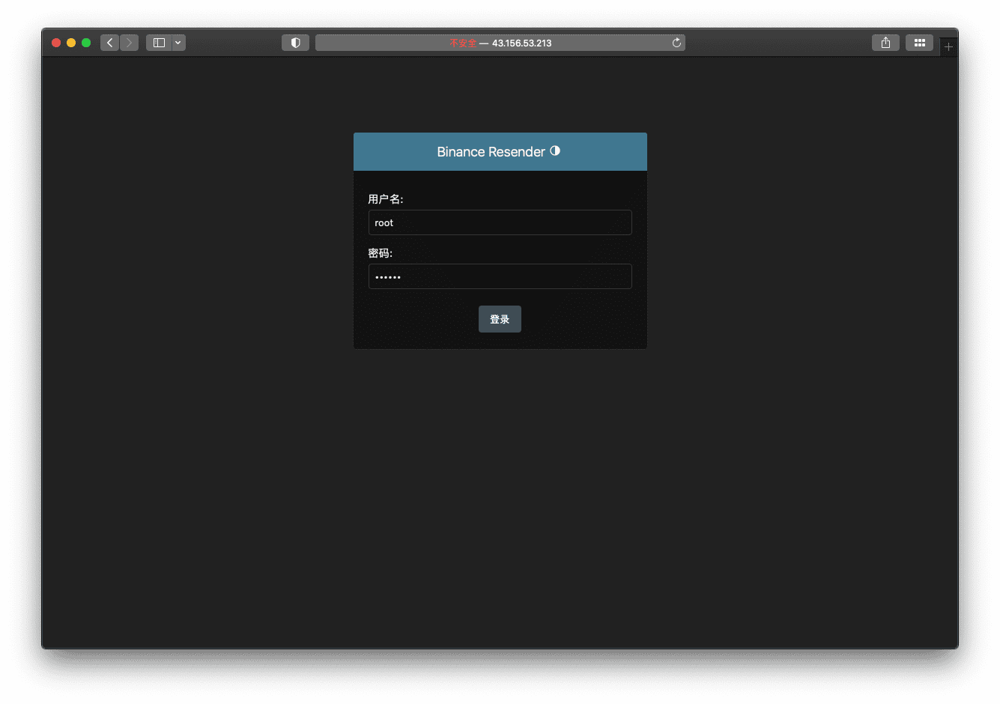


### 6.2 修改管理员登录密码


点击“用户”。

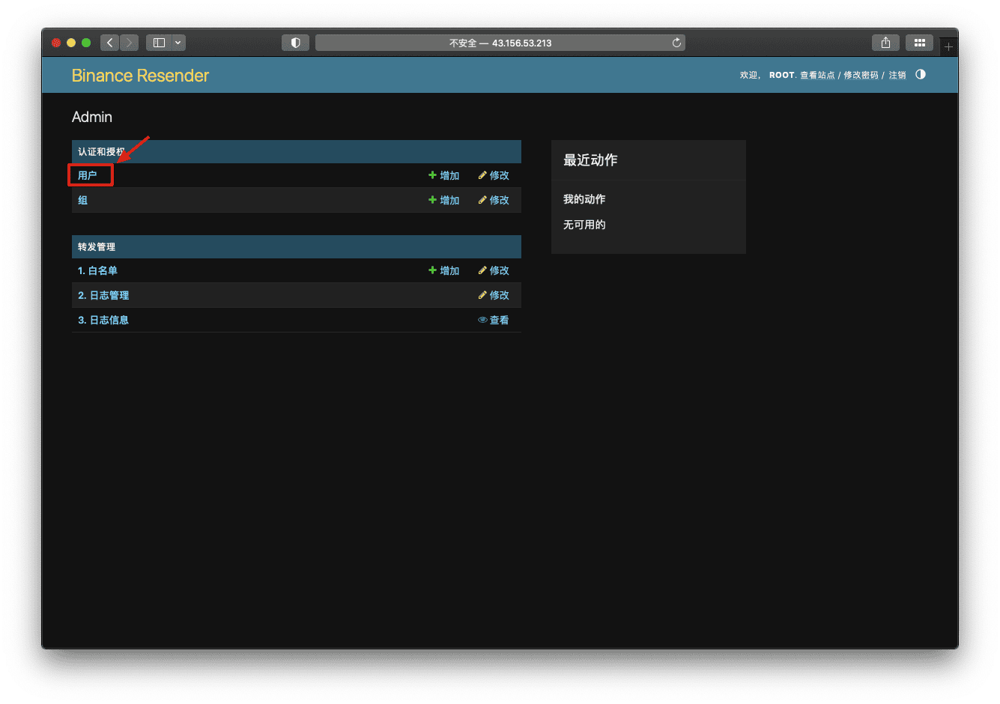

点击“root”。

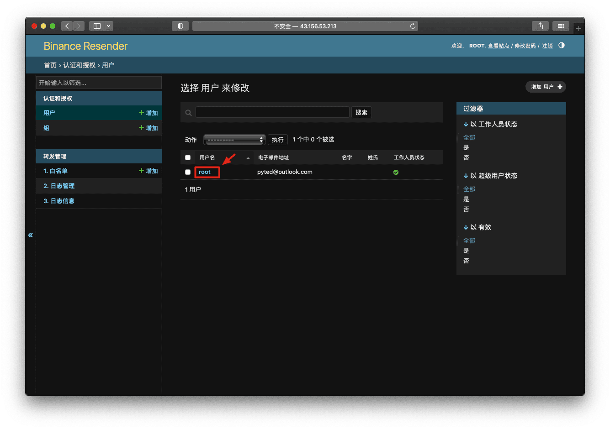

点击表单。

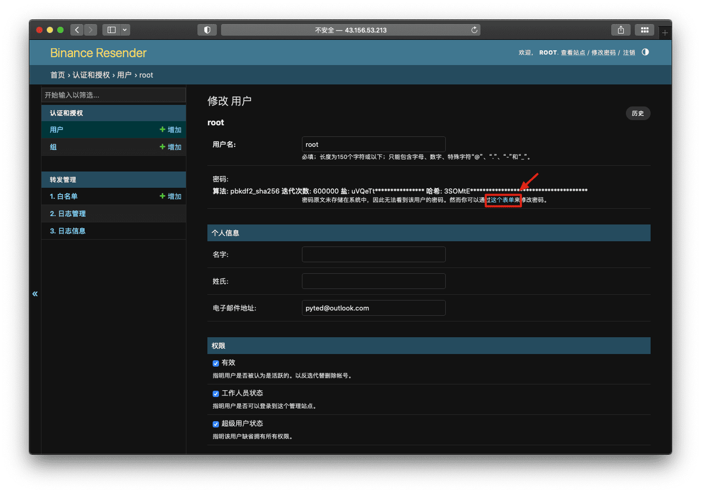

输入新密码，点击“修改”。

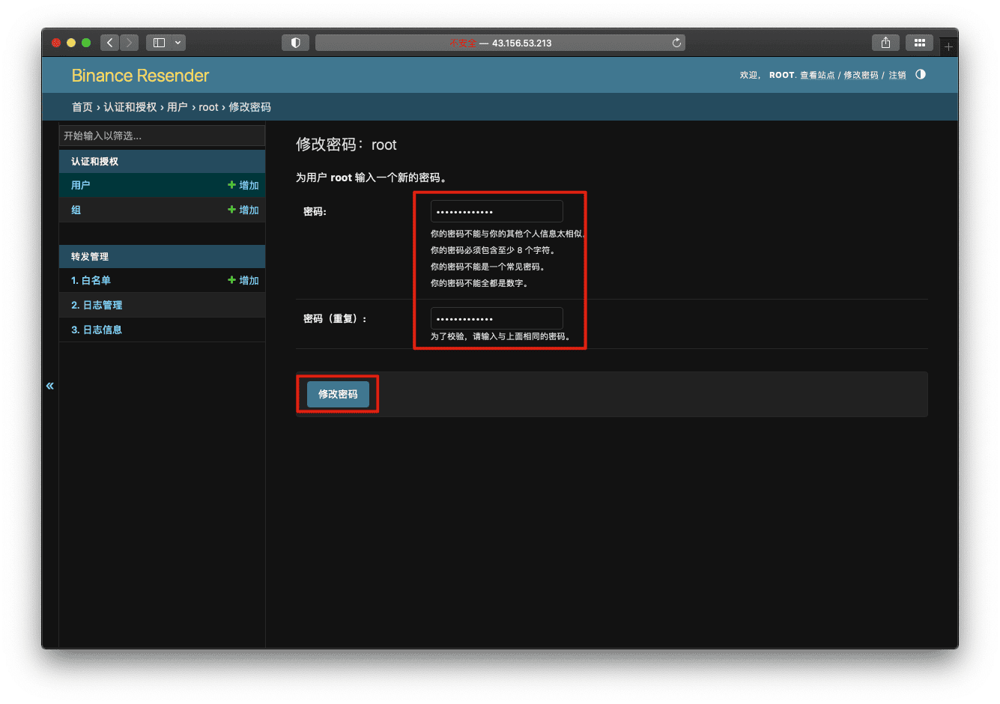


### 6.3 添加IP白名单

点击“白名单”。

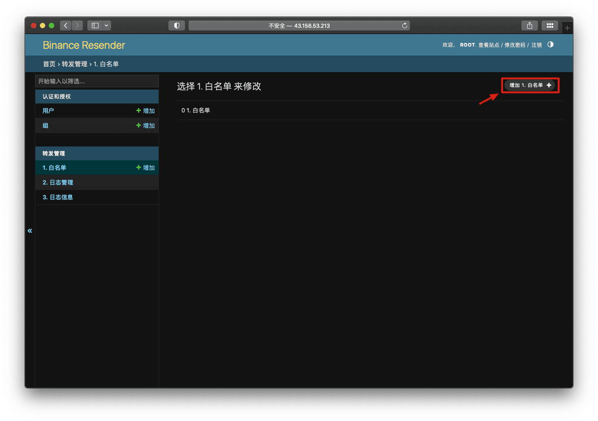

添加IP地址。

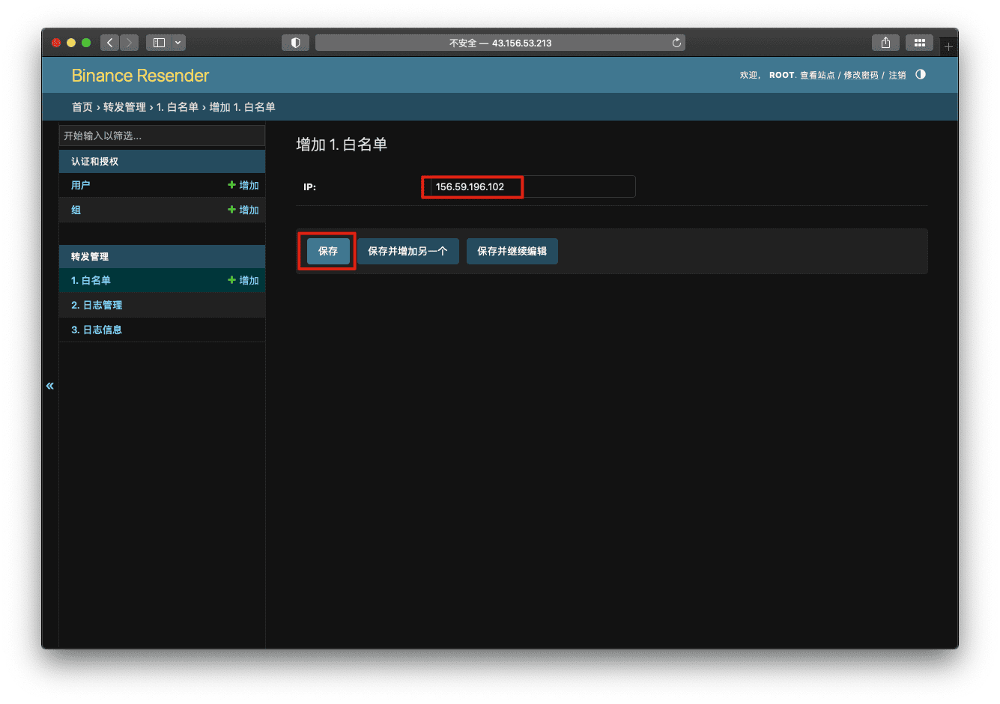

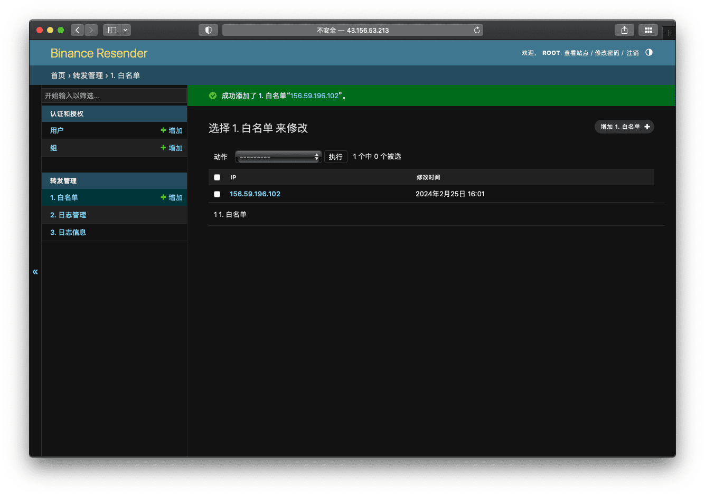

测试转发

```python
from binance_interface.api import API
from binance_interface.app.utils import eprint

if __name__ == '__main__':
    proxy_host = 'http://43.156.53.213'  # Binance_resender地址
    api = API(proxy_host=proxy_host)
    ticker_result = api.spot.market.get_ticker_bookTicker(symbol='BTCUSDT')
    eprint(ticker_result)
```

输出：

```text
>>> {'code': 200,
>>>  'data': {'symbol': 'BTCUSDT',
>>>           'bidPrice': '51755.25000000',
>>>           'bidQty': '7.19454000',
>>>           'askPrice': '51755.26000000',
>>>           'askQty': '0.91531000'},
>>>  'msg': ''}
```

### 6.4 日志管理

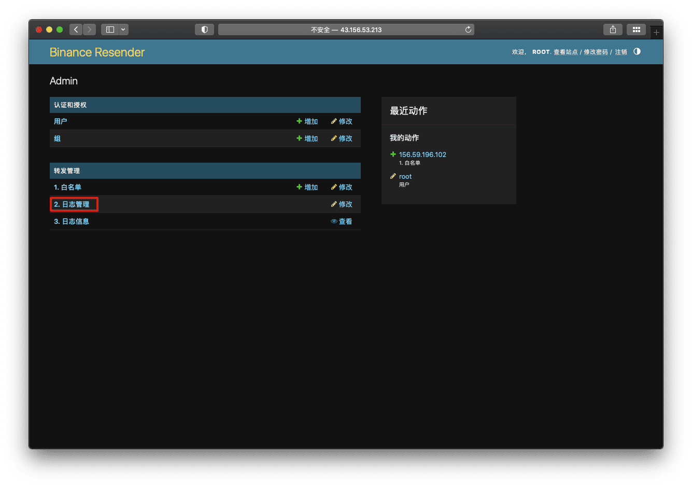

修改是否启动记录日志。

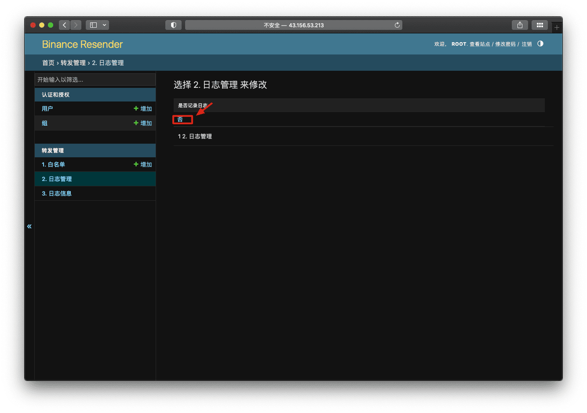


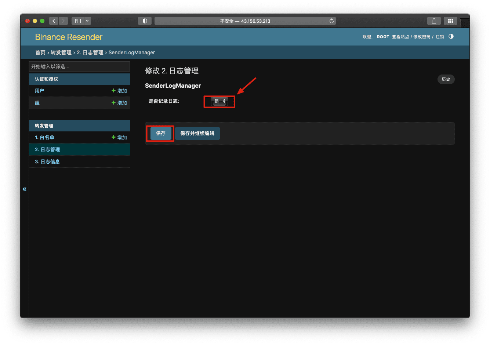

### 6.5 日志信息

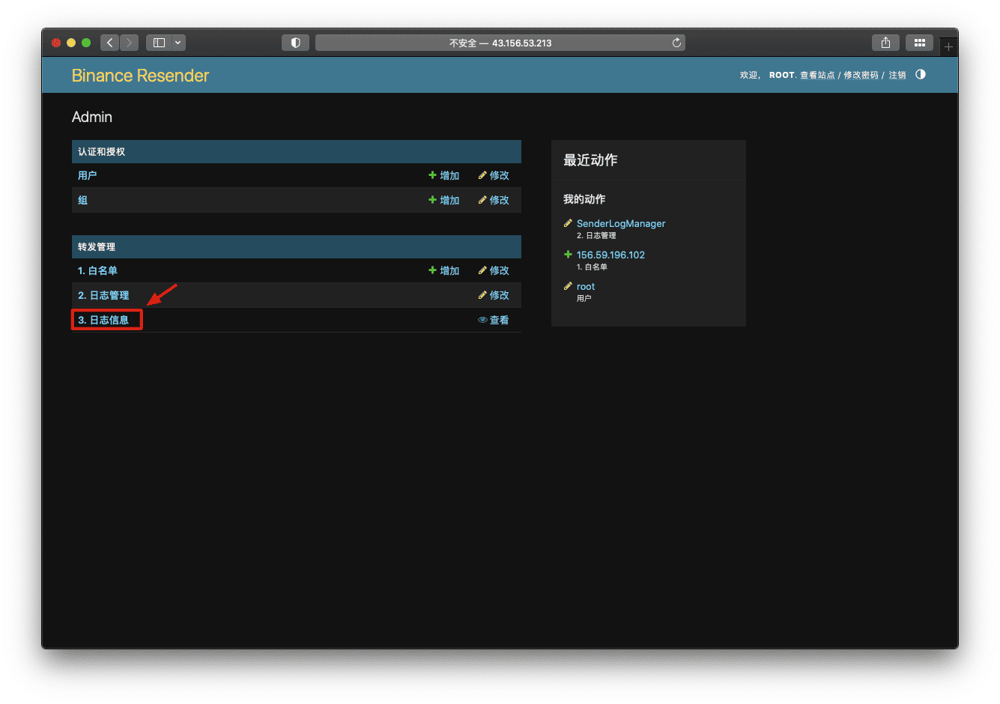

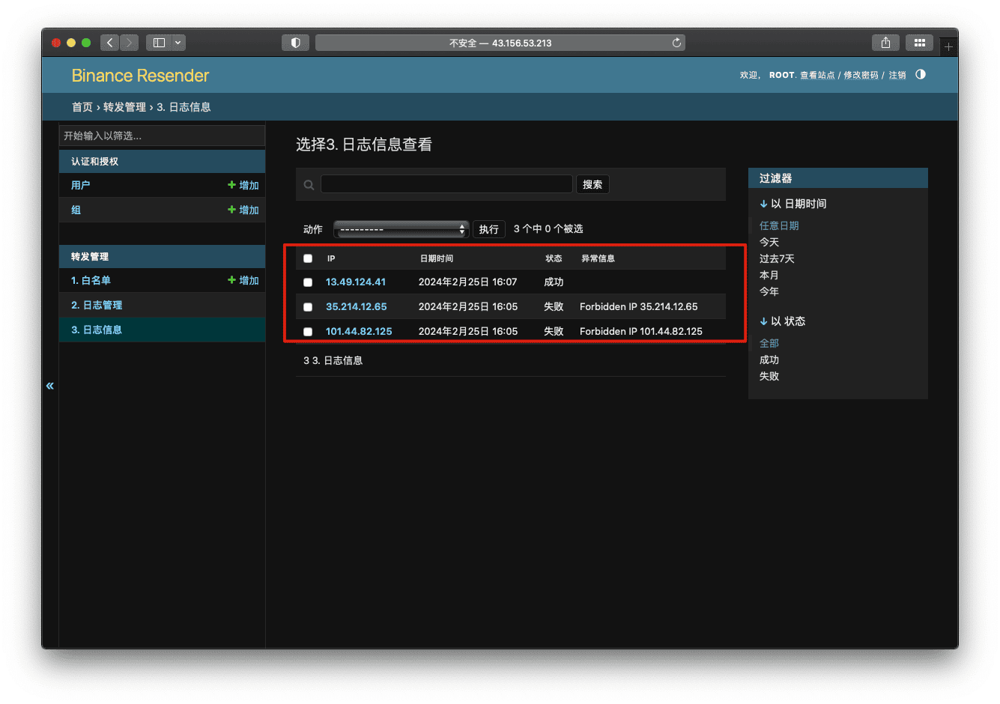


## 7. PyTED对于Binance_resender的使用建议

1. 注意服务器的带宽，最佳应>=30Mpbs，因为有些单次请求的数据量较大，转发速度的瓶颈在于带宽（例如：获取全部产品信息）；
2. 不建议打开日志记录功能，极简配置更利于转发速率；
3. 推荐使用服务器的内网调用，减少通信延迟；
4. 对于时间粒度为1s的高频交易，实时价格信息同步不建议使用Binance_resender；
    - 以新加坡服务器为例。内地通过Binance_resender转发并获得响应的平均等待时间为：230ms（公网通信）
    - 新加坡服务器与Binance通信的平均等待时间为：80ms